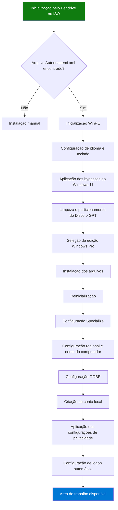

# Instalação Automatizada do Windows


Este projeto disponibiliza um arquivo de configuração chamado `Autounattend.xml`, desenvolvido para automatizar completamente a instalação do **Windows 10** e **Windows 11 (64 bits / amd64)**.

O arquivo permite realizar uma instalação sem interação manual, automatizando etapas como:

* Seleção de idioma e teclado;
* Aceite dos termos de licença;
* Particionamento do disco;
* Seleção da edição do Windows;
* Criação de usuário local;
* Configurações iniciais do sistema;
* Aplicação de configurações de privacidade e otimização.

O objetivo é fornecer uma instalação padronizada e reproduzível para computadores físicos e máquinas virtuais.

---

# Avisos Importantes

## Formatação Automática do Disco

> [!WARNING]
> O arquivo está configurado para apagar completamente o **Disco 0** (`WillWipeDisk`), que normalmente corresponde ao disco principal do computador.
>
> Todos os dados existentes serão removidos durante o processo de instalação.
>
> Utilize este projeto somente em equipamentos:
>
> * Sem dados importantes armazenados;
> * Com backup previamente realizado;
> * Destinados à reinstalação do sistema operacional.

---

## Compatibilidade de Firmware

> [!IMPORTANT]
> Esta configuração foi desenvolvida para computadores utilizando:
>
> * Firmware UEFI;
> * Particionamento GPT.
>
> Equipamentos configurados em modo Legacy BIOS, CSM ou utilizando MBR precisam de ajustes no arquivo de configuração.

---

# Visão Geral do Processo

## Fluxo da Instalação



---

# Funcionalidades

O arquivo `Autounattend.xml` automatiza as principais fases da instalação do Windows:

* Windows PE (`windowsPE`);
* Configuração do sistema (`specialize`);
* Experiência inicial do usuário (`oobeSystem`).

---

# Fase 1 - Preparação da Instalação (WinPE)

## Idioma e Teclado

Configuração aplicada:

| Configuração       | Valor              |
| ------------------ | ------------------ |
| Idioma             | Português (Brasil) |
| Região             | Brasil             |
| Teclado            | ABNT2              |
| Código do teclado  | `0416:00010416`    |
| Idioma alternativo | Inglês (en-US)     |

---

## Bypass de Requisitos do Windows 11

São aplicadas configurações no registro através do `LabConfig` para ignorar verificações de hardware:

| Requisito     | Configuração            |
| ------------- | ----------------------- |
| TPM 2.0       | `BypassTPMCheck`        |
| Secure Boot   | `BypassSecureBootCheck` |
| Processador   | `BypassCPUCheck`        |
| Memória RAM   | `BypassRAMCheck`        |
| Armazenamento | `BypassStorageCheck`    |

---

## Particionamento Automático

O Disco 0 é removido e configurado utilizando GPT:

| Partição | Tamanho         | Sistema de arquivos |
| -------- | --------------- | ------------------- |
| EFI      | 300 MB          | FAT32               |
| MSR      | 16 MB           | Reservada           |
| Windows  | Espaço restante | NTFS                |

---

## Licenciamento

Os termos de licença do Windows são aceitos automaticamente.

A chave utilizada para seleção da edição é:

```
W269N-WFGWX-YVC9B-4J6C9-T83GX
```

Esta chave seleciona a edição **Windows Pro** e não realiza a ativação do sistema.

---

# Fase 2 - Configuração do Sistema (Specialize)

Configurações aplicadas:

* Geração automática do nome do computador;
* Proprietário definido como `UserLocal`;
* Fuso horário configurado como:

```
E. South America Standard Time
```

* Idioma regional mantido como pt-BR;
* Teclado ABNT2 configurado no sistema instalado.

---

# Fase 3 - Configuração Inicial (OOBE)

## Criação de Conta Local

O instalador cria automaticamente:

```
Usuário:
UserLocal

Grupo:
Administrators

Senha:
Em branco
```

---

## Configuração de Logon Automático

O sistema é configurado para realizar login automático utilizando a conta:

```
UserLocal
```

---

## Configurações de Privacidade

Durante o primeiro login são executadas configurações para:

* Desativar Cortana;
* Reduzir telemetria;
* Desativar recursos de consumidor;
* Remover sugestões e aplicativos promocionais;
* Desativar Windows Spotlight;
* Remover dicas de boas-vindas.

Configurações aplicadas:

```text
AllowCortana = 0

AllowTelemetry = 0

DisableWindowsConsumerFeatures = 1

DisableSoftLanding = 1
```

---

# Como Utilizar

## Instalação utilizando Pendrive

1. Crie uma mídia de instalação do Windows utilizando:

* Media Creation Tool;
* Rufus;
* Outra ferramenta compatível.

2. Copie o arquivo:

```
Autounattend.xml
```

3. Coloque o arquivo na raiz do pendrive.

Exemplo:

```
Pendrive
│
├── Autounattend.xml
│
├── boot
├── efi
├── sources
└── setup.exe
```

4. Inicialize o computador pelo pendrive.

A instalação será executada automaticamente.

---

## Instalação utilizando ISO personalizada

1. Abra a ISO oficial do Windows em uma ferramenta de edição.

Exemplos:

* UltraISO;
* AnyBurn.

2. Adicione:

```
Autounattend.xml
```

na raiz da ISO.

3. Salve a nova imagem.

A ISO poderá ser utilizada em:

* VMware;
* VirtualBox;
* Hyper-V;
* Instalações físicas.

---

# Solução de Problemas

## A instalação solicita idioma e teclado

### Causa

O Windows não encontrou o arquivo `Autounattend.xml`.

Possíveis causas:

* Arquivo colocado dentro de uma pasta;
* Nome incorreto;
* Extensão alterada para:

```
Autounattend.xml.txt
```

### Solução

Confirme que o arquivo está na raiz da mídia e possui exatamente o nome:

```
Autounattend.xml
```

No Windows Explorer:

```
Exibir → Extensões de nomes de arquivos
```

Caso utilize Rufus, desative opções que criem configurações próprias de instalação automática.

---

## Erro de chave de produto

Mensagem:

```
A chave de produto digitada não corresponde a nenhuma imagem do Windows
```

### Causa

A ISO utilizada não possui a edição Windows Pro.

### Solução

Remova o bloco:

```xml
<ProductKey>
...
</ProductKey>
```

ou utilize uma ISO Multi-edition oficial.

---

## Loop de instalação após reinicialização

### Causa

O computador continua inicializando pelo pendrive.

### Solução

Quando o instalador informar que o computador será reiniciado:

1. Remova o pendrive;
2. Aguarde a inicialização pelo disco instalado.

---

## Disco incorreto formatado

### Causa

O arquivo utiliza:

```xml
<DiskID>0</DiskID>
```

O instalador sempre selecionará o Disco 0.

### Solução

Antes da instalação:

1. Pressione:

```
Shift + F10
```

2. Execute:

```
diskpart
list disk
```

3. Identifique o disco correto.

Recomenda-se remover discos secundários durante a instalação.

Usuários avançados podem alterar:

```xml
<DiskID>0</DiskID>
```

para o número correto.

---

## Sistema instalado, mas não inicia

Mensagem:

```
No bootable device
```

### Causa

O equipamento está configurado em modo Legacy BIOS/CSM.

### Solução

Acesse a BIOS:

Teclas comuns:

```
DEL
F2
```

Altere:

```
Boot Mode
```

de:

```
Legacy / CSM
```

para:

```
UEFI Only
```

Salve as alterações e execute a instalação novamente.

---

# Compatibilidade

Compatível com:

* Windows 10 x64;
* Windows 11 x64;
* Sistemas UEFI;
* Discos GPT;
* Computadores físicos;
* Máquinas virtuais.

---

# Arquivo Principal

```
Autounattend.xml
```

Este arquivo contém todas as definições utilizadas para automatizar a instalação do Windows.
